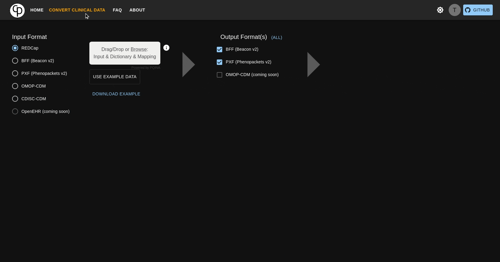

  

    <em>Advancing Semantic Similarity Analysis of Phenotypic Data Stored in GA4GH Standards and Beyond</em>

<!--  -->

**Documentation**: <a href="https://cnag-biomedical-informatics.github.io/pheno-ranker-ui" target="_blank">https://cnag-biomedical-informatics.github.io/pheno-ranker-ui</a>

<!-- **Web APP Playground**: <a href="https://pheno-ranker.cnag.eu" target="_blank">https://pheno-ranker.cnag.eu</a> -->

**CLI Source Code**: <a href="https://github.com/cnag-biomedical-informatics/pheno-ranker" target="_blank">https://github.com/cnag-biomedical-informatics/pheno-ranker</a>

---

`pheno-ranker-ui` is a web-interface for the CPAN's module [Pheno::Ranker](https://metacpan.org/pod/Pheno%3A%3ARanker)
which is a tool designed for performing semantic similarity analysis on phenotypic data structured in JSON format, such as Beacon v2 Models or Phenopackets v2.

# Getting Started

### General pre-requisite:

- Ideally a unix (GNU/Linux, MacOS) based distribution.
  Windows with [WSL (Windows Subsystem for Linux)](https://learn.microsoft.com/en-us/windows/wsl)
  enabled or [Docker Deskop](https://docs.docker.com/desktop/install/windows-install/) should work as well - not tested

- [Docker](https://docs.docker.com/get-docker/) and [Docker compose](https://docs.docker.com/compose/install/) installed

### Quick Start

**_no SSL and user authentication_**
0. git clone this repo and then navigate into the folder pheno-ranker-ui
1. rename the file [example.env](example.env) to .env and fill in the variables
2. Run `docker compose up -d`
3. Open your browser and go to `http://localhost:3838`

### For self-hosters:

**_SSL and keycloak-based user authentication_**

pheno-ranker is designed to be run as a collection of microservices.
Please consult [dev_docs/how_to_self_host_w_keycloak_login_enabled.md](dev_docs/how_to_self_host_w_keycloak_login_enabled.md)
how to prepare your environment and run the services.

### CITATION

The author requests that any published work that utilizes `pheno-ranker-UI` includes a cite to the the following reference:

Rueda, M; Leist, IC et al., (2023). pheno-ranker: A software toolkit for the interconversion of standard data models for phenotypic data \[Software\]. Available from https://github.com/cnag-biomedical-informatics/pheno-ranker

### AUTHOR

Written by Ivo Christopher Leist, PhD student at CNAG [https://www.cnag.eu](https://www.cnag.eu).

### COPYRIGHT AND LICENSE

Copyright (C) 2022-2023, Ivo Christopher Leist - CNAG.

GPLv3 - GNU General Public License v3.0
